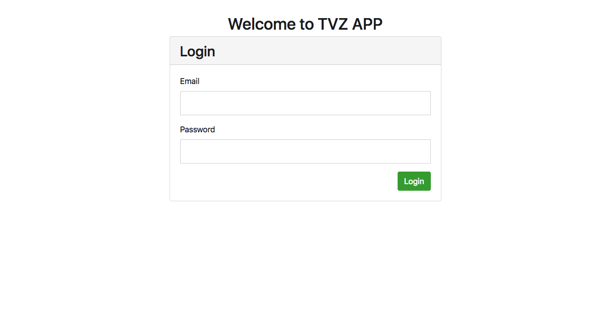
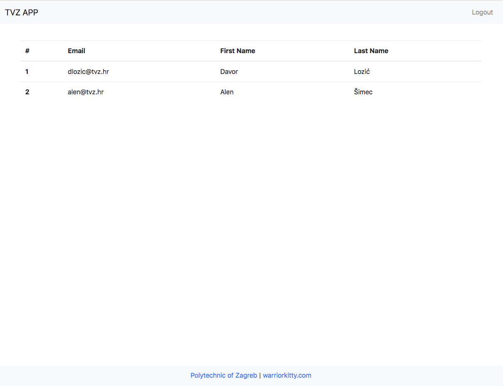

# TVZ APP

## About
This repository is \*only\* for educational purposes and is intended for students at the [Polytechnic of Zagreb](https://www.tvz.hr/). Do \*not\* use this code in production.

## Installation
1. clone the repository with Git or download a zip
2. put the repository in the webroot (C:\xampp\htdocs if XAMPP is used) or execute a simple command ```php -S localhost:8080``` and open it in the browser
2. import *import.sql* file to the database
3. change *db.php* credentials

## Login credentials
email: dlozic@tvz.hr
password: tvz

## Screenshots


